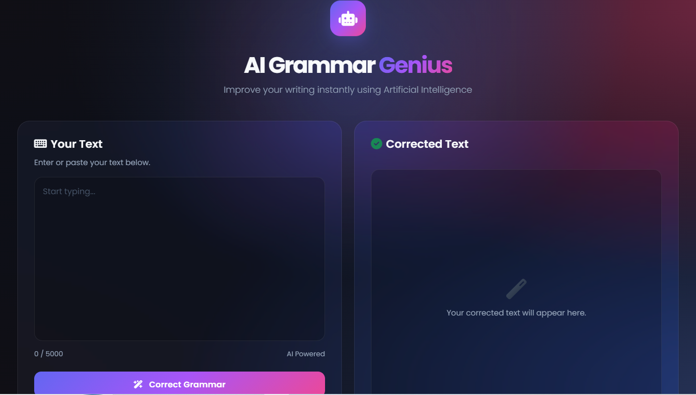

# AI Grammar Checker

An AI-powered grammar checking web application built with **Node.js**, **Express.js**, **EJS**, and the **OpenAI API**. The application helps users improve their writing by correcting grammar, punctuation, and sentence structure instantly.

## ✨ Features

* AI-powered grammar correction
* Grammar quality score
* Copy corrected text with one click
* Clean and responsive user interface
* Fast and easy to use

## 🛠️ Tech Stack

* HTML5
* CSS3
* JavaScript
* Node.js
* Express.js
* EJS
* OpenAI API

## 📸 Screenshot



## 🚀 Getting Started

### 1. Clone the repository

```bash
git clone https://github.com/your-username/AI-Grammar-Checker.git
```

### 2. Install dependencies

```bash
npm install
```

### 3. Create a `.env` file

```env
OPENAI_API_KEY=your_api_key_here
```

### 4. Start the application

```bash
npm start
```

Open your browser and visit:

```
http://localhost:3000
```

## 📂 Project Structure

```
AI-Grammar-Checker/
│── public/
│── views/
│── app.js
│── package.json
│── package-lock.json
│── .env
│── .gitignore
└── README.md
```

## 📌 Future Improvements

* Multiple writing tones
* Text summarization
* Translation support
* User authentication
* History of previous corrections

## 👨‍💻 Author

**Anaswara Padiyara**

Graduate | MERN Stack Developer | Full Stack Developer

LinkedIn: *(Add your LinkedIn profile link here)*
